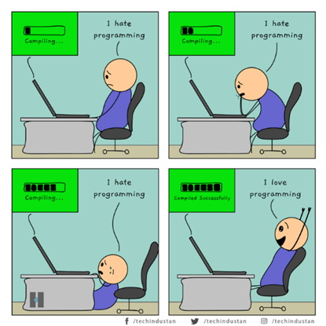

<h1 align="center">Grundlagen der Programmierung</h1>
<h3 align="center">Variablen und Datentypen</h3>
 

  

#### Beschreibung:

Willkommen zur dritten Übung. Heute geht es um Fehler, die vom Compiler gefunden werden, und um Laufzeitfehler.

#### Hinweise zur Bearbeitung:

- Achte auf einen sauberen Quellcode, insbesondere Einrückungen sind wichtig!
- Wichtige Materialien für heute:
  - [Vorlesung](https://docs.google.com/presentation/d/1j5j8gRzKFhigU4V6luoT9l9e3chQI27J/edit#slide=id.p1)
  - [Handbuch: Grundlagen -> Kompilieren / Compilezeit / Compilerfehler](https://docs.google.com/document/d/13SyoQ3tgIr4T9tiUl42V5kiBGQwV4Lk-XA2SsKf-va0/edit#heading=h.mt7e1hlxubl5)

---

 <b> Aufgabe 1 - Fehler finden und beheben </b> 

In der Aufgabe ist ein Codeausschnitt gegeben. Behebe den/die Compilerfehler.

**Datei für die Aufgabe:** *1_Fehler_finden.kt*

---

 <b> Aufgabe 2 - Fehler finden und beheben </b> 

In der Aufgabe ist ein Codeausschnitt gegeben. Behebe den/die Compilerfehler.

**Datei für die Aufgabe:** *2_Fehler_finden.kt*

---

 <b> Aufgabe 3 - Fehler finden und beheben </b> 

In der Aufgabe ist ein Codeausschnitt gegeben. Behebe den/die Compilerfehler.

**Datei für die Aufgabe:** *3_Fehler_finden.kt*

---

 <b> Aufgabe 4 - fehler finden und beheben </b> 

In der Aufgabe ist ein Codeausschnitt gegeben. Behebe den/die Compilerfehler.

**Datei für die Aufgabe:** *4_Fehler_finden.kt*

---

 <b> Aufgabe 5 - Variablen anlegen ohne Fehler </b> 

Lege zwei Variablen an und lasse sie beide in der Konsole anzeigen. Vermeide Compilerfehler.

**Datei für die Aufgabe:** *5_Variabeln_anlegen_ohne_Fehler.kt*

---

 <b> Aufgabe 6 - Laufzeitfehler </b> 

In der Aufgabe wird eine Exception ausgelöst. Behebe den Laufzeitfehler!

**Datei für die Aufgabe:** *6_Laufzeitfehler.kt*

---

 <b> Aufgabe 7 - Laufzeitfehler </b> 

In der Aufgabe wird eine Exception ausgelöst. Behebe den Laufzeitfehler!

**Datei für die Aufgabe:** *7_Laufzeitfehler.kt*

---

 <b> Aufgabe 8 - Fehler finden</b> 

In der Aufgabe ist ein Codeausschnitt gegeben. Behebe den Compilerfehler.

**Datei für die Aufgabe:** *8_Fehler_finden.kt*

---

 <b> Aufgabe 9 - Fehler finden </b> 

In der Aufgabe ist ein Codeausschnitt gegeben. Behebe den Compilerfehler.

**Datei für die Aufgabe:** *9_Fehler_finden.kt*

---

 <b> Aufgabe 10 - Ausgabe ohne Fehler </b> 

Gib die drei Variablen ohne Fehler auf der Konsole aus.

**Datei für die Aufgabe:** *10_Ausgabe_ohne_Fehler.kt*

---

 <b> Aufgabe 11 - Fehler finden </b> 

In der Aufgabe ist ein Codeausschnitt gegeben. Behebe den Compilerfehler.

**Datei für die Aufgabe:** *11_DFehler_finden.t*

---

 <b> Aufgabe 12 - Fehler finden </b> 

In der Aufgabe ist ein Codeausschnitt gegeben. Behebe den Compilerfehler.

**Datei für die Aufgabe:** *12_Fehler_finden.kt*

---

 <b> Aufgabe 13 - Fehler finden </b> 

In der Aufgabe ist ein Codeausschnitt gegeben. Behebe den/die Compilerfehler.

**Datei für die Aufgabe:** *13_Fehler_finden.kt*

---

 <b> Aufgabe 14 - Fehler finden </b> 

In der Aufgabe ist ein Codeausschnitt gegeben. Behebe den Compilerfehler.

**Datei für die Aufgabe:** *14_Fehler_finden*

---

 <b> Aufgabe 15 - Fehler finden </b> 

In der Aufgabe ist ein Codeausschnitt gegeben. Behebe den Compilerfehler.

**Datei für die Aufgabe:** *15_Fehler_finden.kt*

---

